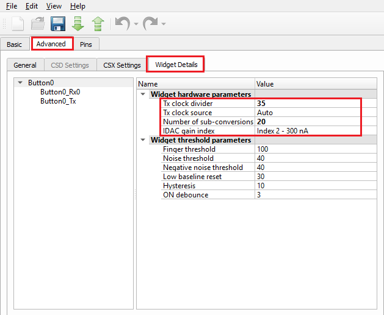
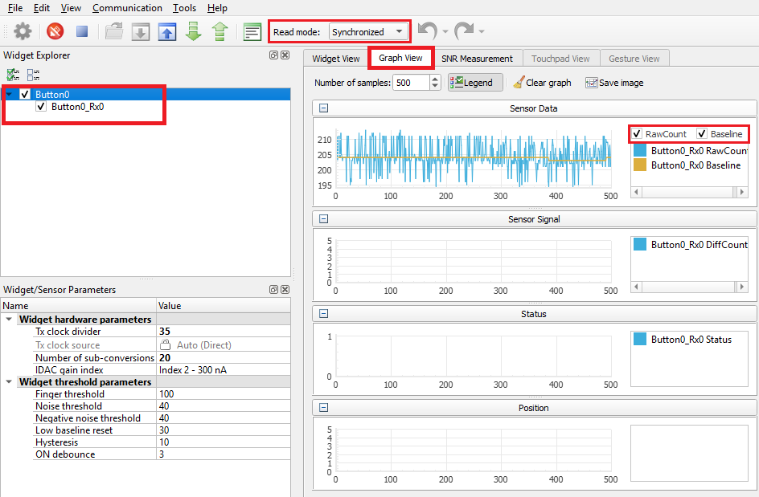
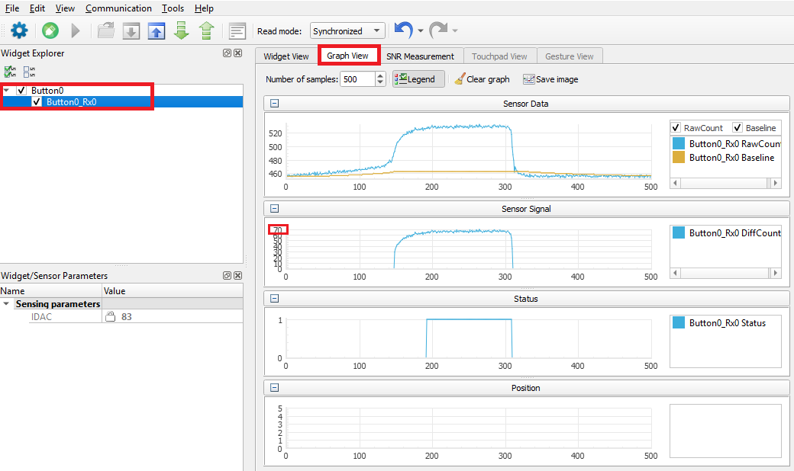

# PSoC 4: CapSense CSX Button Tuning

This code example demonstrates how to manually tune a mutual capacitance (CSX)-based button widget in PSoC® 4 devices using the CapSense® Tuner.

## Overview

This document provides the following:

   1. A high-level overview of the CSX widget tuning flow
   2. An example to show how to manually tune a CSX button widget
   3. Details on how to use the CapSense Tuner to monitor the CapSense raw data and fine-tune the CSX button for optimum performance such as reliability, power consumption, and response time

The code scans a single button widget using the CSX sensing method. It also sends the CapSense raw data over an I2C interface to the on-board KitProg which then could be received using the CapSense Tuner GUI. The tuning of the CSX button is performed with the help of data that is received in the CapSense Tuner GUI. The successful tuning of the button is indicated by an user LED in the kit, the LED is turned ‘ON’ when the finger touches the button and turned ‘OFF’ when the finger is lifted from the CSX button.

[Provide feedback on this Code Example.](https://cypress.co1.qualtrics.com/jfe/form/SV_1NTns53sK2yiljn?Q_EED=eyJVbmlxdWUgRG9jIElkIjoiQ0UyMzA2NjAiLCJTcGVjIE51bWJlciI6IjAwMi0zMDY2MCIsIkRvYyBUaXRsZSI6IlBTb0MgNDogQ2FwU2Vuc2UgQ1NYIEJ1dHRvbiBUdW5pbmciLCJyaWQiOiJicnZpIiwiRG9jIHZlcnNpb24iOiIyLjAuMCIsIkRvYyBMYW5ndWFnZSI6IkVuZ2xpc2giLCJEb2MgRGl2aXNpb24iOiJNQ0QiLCJEb2MgQlUiOiJJQ1ciLCJEb2MgRmFtaWx5IjoiUFNPQyJ9)

## Requirements

- [ModusToolbox® software](https://www.cypress.com/products/modustoolbox-software-environment) v2.2

  **Note:** This code example version requires ModusToolbox software version 2.2 or later and is not backward compatible with v2.1 or older versions. 

- Board Support Package (BSP) minimum required version: 1.0.0
- Programming Language: C
- Associated Parts: [PSoC 4000S](https://www.cypress.com/documentation/datasheets/psoc-4-psoc-4000s-family-datasheet-programmable-system-chip-psoc), [PSoC 4100S](https://www.cypress.com/documentation/datasheets/psoc-4-psoc-4100s-family-datasheet-programmable-system-chip-psoc), and [PSoC 4100S Plus](https://www.cypress.com/documentation/datasheets/psoc-4-psoc-4100s-plus-datasheet-programmable-system-chip-psoc)

## Supported Toolchains (make variable 'TOOLCHAIN')

- GNU Arm® Embedded Compiler v9.3.1 (`GCC_ARM`) - Default value of `TOOLCHAIN`
- Arm compiler v6.11 (`ARM`)
- IAR C/C++ compiler v8.42.2 (`IAR`)

## Supported Kits (make variable 'TARGET')

- [PSoC 4100S Plus Prototyping Kit](https://www.cypress.com/CY8CKIT-149) (CY8CKIT-149) - Default target
- [PSoC 4000S CapSense Prototyping Kit](https://www.cypress.com/CY8CKIT-145) (CY8CKIT-145)
- [PSoC 4100S CapSense Pioneer Kit](https://www.cypress.com/CY8CKIT-041-41xx) (CY8CKIT-041-41XX)

## Hardware Setup

This example uses the board's default configuration. See the kit user guide to ensure that the board is configured correctly.

**Note:** PSoC 4 kits ship with KitProg2 installed. ModusToolbox software requires KitProg3. Before using this code example, make sure that the board is upgraded to KitProg3. The tool and instructions are available in the [Firmware Loader](https://github.com/cypresssemiconductorco/Firmware-loader) GitHub repository. If you do not upgrade, you will see an error like "unable to find CMSIS-DAP device" or "KitProg firmware is out of date".

## Software Setup

This example requires no additional software or tools.

## Using the Code Example

### In Eclipse IDE for ModusToolbox:

1. Click the **New Application** link in the **Quick Panel** (or, use **File** > **New** > **ModusToolbox Application**). This launches the [Project Creator](http://www.cypress.com/ModusToolboxProjectCreator) tool.

2. Pick a kit supported by the code example from the list shown in the **Project Creator - Choose Board Support Package (BSP)** dialog.

   When you select a supported kit, the example is reconfigured automatically to work with the kit. To work with a different supported kit later, use the [Library Manager](https://www.cypress.com/ModusToolboxLibraryManager) to choose the BSP for the supported kit. You can use the Library Manager to select or update the BSP and firmware libraries used in this application. To access the Library Manager, click the link from the **Quick Panel**.

   You can also just start the application creation process again and select a different kit.

   If you want to use the application for a kit not listed here, you may need to update the source files. If the kit does not have the required resources, the application may not work.

3. In the **Project Creator - Select Application** dialog, choose the example by enabling the checkbox.

4. Optionally, change the suggested **New Application Name**.

5. Enter the local path in the **Application(s) Root Path** field to indicate where the application needs to be created.

   Applications that can share libraries can be placed in the same root path.

6. Click **Create** to complete the application creation process.

For more details, see the [Eclipse IDE for ModusToolbox User Guide](https://www.cypress.com/MTBEclipseIDEUserGuide) (locally available at *{ModusToolbox install directory}/ide_{version}/docs/mt_ide_user_guide.pdf*).

### In Command-line Interface (CLI):

ModusToolbox provides the Project Creator as both a GUI tool and a command line tool to easily create one or more ModusToolbox applications. See the "Project Creator Tools" section of the [ModusToolbox User Guide](https://www.cypress.com/ModusToolboxUserGuide) for more details.

Alternatively, you can manually create the application using the following steps:

1. Download and unzip this repository onto your local machine, or clone the repository.

2. Open a CLI terminal and navigate to the application folder.

   On Linux and macOS, you can use any terminal application. On Windows, open the **modus-shell** app from the Start menu.

   **Note:** The cloned application contains a default BSP file (*TARGET_xxx.mtb*) in the *deps* folder. Use the [Library Manager](https://www.cypress.com/ModusToolboxLibraryManager) (`make modlibs` command) to select and download a different BSP file, if required. If the selected kit does not have the required resources or is not [supported](#supported-kits-make-variable-target), the application may not work.

3. Import the required libraries by executing the `make getlibs` command.

Various CLI tools include a `-h` option that prints help information to the terminal screen about that tool. For more details, see the [ModusToolbox User Guide](https://www.cypress.com/ModusToolboxUserGuide) (locally available at *{ModusToolbox install directory}/docs_{version}/mtb_user_guide.pdf*).

### In Third-party IDEs:

1. Follow the instructions from the [CLI](#in-command-line-interface-cli) section to create the application, and import the libraries using the `make getlibs` command.

2. Export the application to a supported IDE using the `make <ide>` command.

    For a list of supported IDEs and more details, see the "Exporting to IDEs" section of the [ModusToolbox User Guide](https://www.cypress.com/ModusToolboxUserGuide) (locally available at *{ModusToolbox install directory}/docs_{version}/mtb_user_guide.pdf*.

3. Follow the instructions displayed in the terminal to create or import the application as an IDE project.

## Tuning Flow Summary

The following flowchart gives a high-level summary on how to tune a CSX-based CapSense button in PSoC 4 devices. See the “Manual Tuning” section in [AN85951 – PSoC 4 and PSoC 6 MCU CapSense Design Guide](https://www.cypress.com/documentation/application-notes/an85951-psoc-4-and-psoc-6-mcu-capsense-design-guide) for information on the hardware and threshold parameters that determines the CapSense touch performance.

**Figure 1. High-Level Overview of CSX Button Tuning**


## Operation

This process involves the following stages:

- Stage 1: [Set Initial Hardware Parameters](#stage-1-set-initial-hardware-parameters)

- Stage 2: [Measure SNR](#stage-2-measure-snr)

- Stage 3: [Modify Hardware Parameters or Adjust Filter Settings](#stage-3-modify-hardware-parameters-or-adjust-filter-settings)

- Stage 4: [Set Threshold Parameters](#stage-4-set-threshold-parameters)


### Stage 1: Set Initial Hardware Parameters

1. Connect the board to your PC using the provided micro USB cable through the KitProg3 USB connector.

2. Launch the **CapSense Configurator**. See the "Launch the CapSense Configurator" section from the [ModusToolbox CapSense Configurator Guide](https://www.cypress.com/file/492896/download).

3. In the **Basics** tab, you will find a single widget ‘Button0’ configured as a CSX button.

4. Navigate to the **Advanced** tab and then select the **General settings** sub-tab. Leave all the filter parameters at their default settings. Filters will be enabled depending on the SNR and system time requirements.

   Click **Enable self-test library** to perform sensors capacitance measurement as explained in the [Calculate the Maximum Tx Clock Frequency](#calculate-the-maximum-tx-clock-frequency) section.

   **Figure 2. CapSense Configurator - General Settings**

   

5. Select the **Advanced** tab and then select the **CSX Settings** sub-tab. Configure the parameters as Table 1 and Figure 3 show.

   **Table 1. Advanced Tab - CSX Settings**

   | Parameter | Value | Remarks |
   | --- | --- | --- |
   | Modulator clock divider | 1 (To obtain the maximum allowed by the selected device) | Higher modulator clock frequency reduces flat spots, and increases measurement accuracy and sensitivity. Thus, it is recommended to select the highest possible available modulator clock frequency. |
   | Enable IDAC auto-calibration | Checked | Enabling auto-calibration allows the device to automatically choose the optimal IDAC calibration point (for CSX, this is 40 percent of the maximum value). |

   **Figure 3. CapSense Configurator - Advanced CSX Settings**

   

   **Note:** You can change the modulator clock frequency to 48 MHz only after changing the IMO clock frequency to 48 MHz.  To do this, go to the **System Tab** in the **Device Configurator** tool, select *System Clocks > Input > IMO*. Select 48 from the **Frequency(MHz)** drop-down list.

6. Set the Tx clock divider and Tx clock source.

   1. Navigate to the **Advanced** tab and then select the **Widget Details** window.

   2. Set the Tx clock divider as per the following guidelines:

      CapSense configurator in ModusToolbox allows you to set the Tx clock frequency in terms of the Tx clock divider as Equation 1 shows.

      **Equation 1. Ftx Divider**

      

      Set the Tx clock frequency in such a way that it completely charges and discharges the sensor parasitic capacitance for maximum sensitivity. It can be verified by checking the signal in an oscilloscope or it can be set using the following equation:

      **Equation 2. Maximum Tx Clock Frequency Criterion**

      

      C<sub>P_Tx</sub> and C<sub>P_Rx</sub> are the parasitic capacitances of Tx and Rx electrode respectively.

      R<sub>Series</sub> is the recommended external series resistance(connected on PCB trace connecting sensor pad to the device pin), and trace resistance if using highly resistive materials (example ITO or conductive ink).

      #### Calculate the Maximum Tx Clock Frequency

      **Note:** While using this procedure, ensure that you have enabled the *Enable self-test library* option in the CapSense Configurator. After you obtained the Cp value, you can disable this option.

      1. Estimate the C<sub>p</sub> of the Tx and Rx electrodes. Use the `Cy_CapSense_MeasureCapacitanceSensor()` function to measure the parasitic capacitance(C<sub>p</sub>) of the Tx and Rx electrode of the CSX button. The C<sub>p</sub> can be measured using an LCR meter also.

      2. Program the board in Debug mode.

         In the IDE, use the **\<Application Name> Debug (KitProg3_MiniProg4)** configuration in the **Quick Panel**.

         For more details, see the "Program and Debug" section in the Eclipse IDE for ModusToolbox User Guide: *{ModusToolbox install directory}/ide_{version}/docs/mt_ide_user_guide.pdf*.

      3. Place a breakpoint after the capacitance measurement.

      4. In the **Expressions** window, add the Cp measurement variables `tx_cp` and `rx_cp`.

         The status of the measurement can also be read through the return value of the function in the **Expressions** window.

      5. Click **Resume** (green arrow) to reach the breakpoint.

         Note that the function return value reads `CY_CAPSENSE_BIST_SUCCESS_E` and the measurement variables provide capacitance of the sensor elements in *femtofarads* as Figure 4 shows.

      6. Click **Terminate** (red box) to exit Debug mode.

         **Figure 4. Cp Measurement Using BIST**

         

      Using BIST, the C<sub>P</sub> of the Tx and Rx electrodes were estimated to be as shown in Table 2. Set the Tx Clock Divider to the value obtained(using equation 1) in Table 2 in the CapSense Configurator as shown in Figure 5. Note that for the PSoC 4 S-Series, PSoC 4100S Plus, and PSoC 4100PS family of devices, the maximum F<sub>Tx</sub> supported is 3000 kHz.

      **Table 2. Cp of Tx and Rx Electrode, Calculated Maximum Tx Clock Frequency and Tx Clock Divider Setting in Configurator**

      |Development Kit | Tx Pin | Rx Pin | Cp of Tx Electrode (pF) | Cp of Rx Electrode (pF) | External Resistance (ohms) | Calculated Maximum Tx Clock Frequency (kHz)| Initial Tx Clock Divider Setting in Configurator|
      | --- | --- | --- | --- | --- | --- | --- | --- |
      |CY8CKIT-149| P0.2 | P4.6 | 36 | 13 | 2000 | 1388 | 35 |
      |CY8CKIT-145-40XX| P1.3 | P1.4 |22 | 12 | 560 | 8116 | 16 |
      |CY8CKIT-041-41XX| P0.1 | P3.7 |41 | 49 | 560 | 3644 | 16 |

   3. Ensure the following in addition to this condition:

      - The auto-calibrated IDAC code should lie in the mid-range (for example, 30-90) for the selected F<sub>Tx</sub>. If the auto-calibrated IDAC value lies out of the recommended range, F<sub>Tx</sub> is tuned such that IDAC falls in the recommended range. See [Ensure Auto-calibrated IDAC Within Recommended Range](#ensure-auto-calibrated-idac-within-recommended-range).

      - If you are using the SSCx clock source, ensure that you select the Tx clock frequency that meets the conditions mentioned in the [ModusToolbox CapSense Configurator Guide](https://www.cypress.com/file/492896/download) in addition to these conditions.

7.	Set the number of sub-conversions to an initial low value of 20. This will be modified in [Stage 3: Modify Hardware Parameters or Adjust Filter Settings](#stage-3.-modify-hardware-parameters-or-adjust-filter-settings) based on the Signal-to-Noise ratio (SNR) and system timing requirements. Leave all other values in the tab to their default settings.

   **Figure 5. Advanced Tab - Widget Details**

   

   **Note:** The CapSense Initialization may fail at this stage. Ensure that capsense initialization passes after the final tuning parameters are set.

8. Program the board.

   - **Using Eclipse IDE for ModusToolbox:**

      1. Select the application project in the Project Explorer.

      2. In the **Quick Panel**, scroll down, and click **\<Application Name> Program (KitProg3_MiniProg4)**.

   - **Using CLI:**

     From the terminal, execute the `make program` command to build and program the application using the default toolchain to the default target. You can specify a target and toolchain manually:
      ```
      make program TARGET=<BSP> TOOLCHAIN=<toolchain>
      ```

      Example:
      ```
      make program TARGET=CY8CKIT-149 TOOLCHAIN=GCC_ARM
      ```

### Stage 2: Measure SNR

#### Set Up CapSense Tuner to View Sensor Data

1. Launch the **CapSense Tuner**.

   See the "Launch the CapSense Tuner" section from the [ModusToolbox CapSense Tuner Guide](https://www.cypress.com/file/504381/download).

2. Go to **Tools** > **Tuner Communication Setup…** and set the parameters as Figure 6 shows. Click **OK**.

   **Figure 6. Tuner Communication Setup**

   

3. Click **Connect**.

   **Figure 7. CapSense Tuner Window**

   

4. Click **Start**.

   **Figure 8. CapSense Tuner Start**

   

   The **Widget/Sensor Parameters** tab gets updated with the parameters configured in the **CapSense Configurator** window.

   **Figure 9. CapSense Tuner Window**

   

5. Select the *Button0* check box and *Synchronized* under **Read mode**, and then navigate to the **Graph View** as Figure 10 shows.

   The graph view displays the raw counts and baseline for *Button0_Rx0* in the **Sensor Data** window. Ensure that the **Raw Counts** and **Baseline** checkboxes are selected to view the sensor data.

   **Figure 10. CapSense Tuner Graph View**

   

   **Note:** At this point, when the configured button is touched, you may or may not notice the touch signal in the **Sensor Signal** graph. The sensor may false-trigger which can be seen in the touch status going from 0 to 1 in the **Status** window.

#### Ensure Auto-calibrated IDAC Within Recommended Range

6. As discussed in Step 6 of [Stage 1: Set Initial Hardware Parameters](#stage-1-set-initial-hardware-parameters), the Tx clock frequency will be tuned to bring the IDAC code to the recommended range in this step. Click **Button0** in the **Widget Explorer** to view the IDAC value in the sensor parameters window as shown in Figure 11. If the IDAC value is within the range (30 to 90), skip to Step 8 [Measure SNR](#measure-snr); otherwise, follow Step 7 to modify Tx clock divider until the IDAC value is in the desired range.

   **Figure 11. IDAC Value**

   

7. Fine-tune the Tx clock frequency to bring the IDAC value within range.

   1. Click on *Button0* in the **Widget Explorer**.

   2. Increase or decrease the Tx clock divider in the **Widget Hardware Parameters** window in steps of 5. Increasing the Tx clock divider (decreases the Tx clock frequency) will decrease the IDAC value for a fixed IDAC gain and calibration percent and vice versa.

   3. Click the **To Device** button to apply the changes to the device as shown in Figure 12.

      **Figure 12. Apply Changes to Device**

      

   4. Observe the IDAC value in the **Sensor Parameters** section of the **Widget/Sensor Parameters** window.

   5. Repeat steps '1' to '4' until you obtain the IDAC value in the range of 30 to 90.

   After performing these steps, you will arrive at the following Tx clock divider as shown in Table 3.

   **Table 3. Final Tx Clock Frequency**

   |Development Kit | Tx Clock Divider Setting in Configurator|
   | --- | --- |
   |CY8CKIT-149| 60 |
   |CY8CKIT-145-40XX| 120 |
   |CY8CKIT-041-41XX| 220 |

#### Measure SNR

8. Switch to the **SNR Measurement** tab, select the *Button0_Rx0* sensor, and then click **Acquire Noise** as Figure 13 shows.

   **Figure 13. CapSense Tuner - SNR Measurement: Acquire Noise**

   

9. Once the noise is acquired, touch the button on the kit, and then click **Acquire Signal**. Ensure that the finger is on the button as long as the signal acquisition is in progress.

   The calculated SNR on this button is displayed, as Figure 14 shows. Based on your end-system design, test with a finger that matches the size of your normal use case. Typically, finger size targets are ~8 to 9 mm.

   **Figure 14. CapSense Tuner - SNR Measurement: Acquire Signal**

   

### Stage 3: Modify Hardware Parameters or Adjust Filter Settings

1. Skip to [Stage 4: Set Threshold Parameters](#stage-4-set-threshold-parameters) if the following conditions are met:

   - Measured SNR from the previous stage [Measure SNR](#measure-snr) is greater than 5:1.
   - Signal count is greater than 50.
   - Response time requirements are met.

   Perform steps 2 to 4 to ensure that SNR and timing requirements are met. You should tune the buttons for an SNR > 5:1 to avoid triggering on noise, and ensure that all intended touches are registered.

#### Modify Hardware Parameters

2. Increasing the number of sub-conversions increases the signal without increasing the noise at the same rate. Update the number of sub-conversions directly in the **Widget/Sensor Parameters** tab of the CapSense Tuner GUI. Increase the number of sub-conversions in steps and repeat steps in the [Measure SNR](#measure-snr) section until the minimum SNR of 5:1 is achieved. However, increasing the number of sub-conversions will in turn increase the sensor scan time as equation 3 shows:

   **Equation 3. Hardware Scan Time of the CSX Sensor**

   

   where NoC is the number of sub-conversions and F<sub>TX</sub> is the Tx clock frequency.

#### Adjust Filter Settings

3. If your system is very noisy (counts > 20), add a filter. Filters help reduce the noise without increasing the signal. Adding a filter adds to the processing time and memory usage, because this is implemented in firmware and gets executed by the CPU. This also results in increased power consumption.

    - To adjust the filter settings, open **CapSense Configurator** and select the appropriate filter in Step 4. See Figure 15.

    - Reprogram the device to update filter settings.

   **Note:** Add the filter based on the type of noise in your measurements. See [ModusToolbox CapSense Configurator Guide](https://www.cypress.com/file/492896/download) for details.

   **Figure 15. Firmware Filter Settings**

   

Use Table 4 to set the filter settings for different development kits:

**Table 4. Filter Settings for Different Development Kits**

| Development Kit | IIR Filter | IIR Filter Raw Count Coefficient | Median Filter | Average Filter |
| --- | --- | --- | --- | --- |
| CY8CKIT-041-41XX | Enabled | 64 | Disabled | Disabled |
| CY8CKIT-149 | Disabled | NA | Disabled | Disabled |
| CY8CKIT-145-40XX | Disabled | NA | Disabled | Disabled |

#### Timing Requirements

4. If the total sensor scan time meets your requirements, skip to [Stage 4: Set Threshold Parameters](#stage-4-set-threshold-parameters). If not, adjust the tuning to speed up the scan time. If the SNR is greater than 10 on any sensor, lower the number of sub-conversions or remove the filters to decrease the scan time but keep the SNR greater than 5:1. It is best to find a balance between the number of sub-conversions and filters to achieve a proper overall tuning.

Use Table 5 to set the hardware tuning parameters to achieve 5:1 SNR:

**Table 5. Final Hardware Tuning Parameters to Achieve 5:1 SNR**

| Development Kit | Tx Clock Divider Setting in Configurator| Number of Sub-conversions |
| --- | --- | --- |
|CY8CKIT-149| 60 | 20 |
|CY8CKIT-145-40XX| 120 | 20 |
|CY8CKIT-041-41XX<sup>*</sup>| 220 | 30 |

<sup>*</sup>Firmware filters enabled

### Stage 4: Set Threshold Parameters

After you have confirmed that your design meets the timing parameters, and the SNR is greater than 5:1, set your threshold parameters as follows:

1. Switch to the **Graph View** tab and select **Button0**.

2. Touch the sensor and monitor the touch signal in the **Sensor Signal** graph. The **Sensor Signal** graph should show the signal as Figure 17 shows.

   Ensure that you observe the difference count (that is, the signal output) in the **Graph View** tab in Figure 15, not the raw count output for setting these thresholds. Based on your end system design, test the signal with a finger that matches the size of your normal use case. Typically, finger size targets are ~8 to 9 mm. Consider testing with smaller sizes that should be rejected by the system to ensure that they do not reach the finger threshold.

   **Figure 15. Sensor Signal when the Sensor Is Touched**

   


3. When the signal is measured, set the thresholds according to the following recommendations:

   * Finger Threshold = 80 percent of signal

   * Noise Threshold = 40 percent of signal

   * Negative Noise Threshold = 40 percent of signal

   * Hysteresis = 10 percent of signal

   * Debounce = 3

4. Set the threshold parameters in the **Widget/Sensor Parameters** section of the CapSense Tuner GUI, as Figure 16 shows:

   **Figure 16. Widget Threshold Parameters**

   

   See Table 6 to set the threshold parameters in the CapSense Tuner for different development kits.

   **Table 6. Threshold Parameters for Different Development Kits**

   | Development Kit | Difference Counts | Finger Threshold | Noise Threshold | Negative Noise Threshold | Hysteresis | Low Baseline Reset | Debounce |
   | --- | --- | --- | --- | --- | --- | --- | --- |
   |CY8CKIT-149| 65 | 56 | 26 | 26 | 7 | 30 | 3 |
   |CY8CKIT-145-40XX| 80 | 64 | 32 | 32 | 8 | 30 | 3 |
   |CY8CKIT-041-41XX| 65 | 56 | 26 | 26 | 7 | 30 | 3 |

5. Apply the settings to the device and to the project by clicking **To Device** and then **To Project** as Figure 17 shows, and close the tuner.

   **Figure 17. Apply Settings to the Project**

   

4. If your sensor is tuned correctly, you will observe the touch status go from 0 to 1 in the **Status** sub-window of the **Graph View** window as Figure 18 shows. The successful tuning of the button is also indicated by a LED in the kit. The user LED is turned ON when the finger touches the button and turned OFF when the finger is removed from the button.

   **Figure 18. Sensor Status Window**

   

6. Launch **CapSense Configurator**. You should now see all the changes that you have made in the CapSense Tuner reflected in the **CapSense Configurator**.

## Debugging

You can debug the example to step through the code. In the IDE, use the **\<Application Name> Debug (KitProg3_MiniProg4)** configuration in the **Quick Panel**. For more details, see the "Program and Debug" section in the [Eclipse IDE for ModusToolbox User Guide](https://www.cypress.com/MTBEclipseIDEUserGuide).


## Design and Implementation

The project contains a single button widget configured in CSX sensing mode. See the "CapSense CSX Sensing Method" section in [AN85951 – PSoC 4 and PSoC 6 MCU CapSense Design Guide](https://www.cypress.com/documentation/application-notes/an85951-psoc-4-and-psoc-6-mcu-capsense-design-guide) for details on CapSense CSX sensing mode. See the [Operation](#operation) section of this document for step-by-step instructions to configure the other settings of the **CapSense Configurator**.

The project uses the [CapSense Middleware](https://github.com/cypresssemiconductorco/capsense) (see ModusToolbox User Guide for more details on selecting the middleware). See [AN85951 – PSoC 4 and PSoC 6 MCU CapSense Design Guide](https://www.cypress.com/documentation/application-notes/an85951-psoc-4-and-psoc-6-mcu-capsense-design-guide) for more details on CapSense features and usage.

The [ModusToolbox software](https://www.cypress.com/products/modustoolbox-software-environment) provides a GUI-based tuner application for debugging and tuning the CapSense system. The **CapSense Tuner** application works with the EZI2C and UART communication interfaces. This project has an SCB block configured in EZI2C mode to establish communication with the on-board KitProg, which in turn enables reading the CapSense raw data by the CapSense Tuner GUI. See [Resources and Settings](#resources-and-settings).

The CapSense data structure that contains the CapSense raw data is exposed to the CapSense Tuner by setting up the I2C communication data buffer with the CapSense data structure. This enables the CapSense Tuner to access the CapSense raw data for tuning and debugging.

The successful tuning of the button is indicated by a user LED in the kit. The LED is turned ON when the finger touches the button and turned OFF when the finger is removed from the button.

### Resources and Settings

**Figure 19. EZI2C settings**


**Table 7. Application Resources**

| Resource  |  Alias/Object     |    Purpose     |
| :------- | :------------    | :------------ |
| SCB (I2C) (PDL) | CYBSP_EZI2C          | EZI2C slave driver to communicate with CapSense Tuner |
| CapSense | CYBSP_CSD | CapSense driver to interact with the CSD hardware and interface CapSense sensors |
| GPIO (PDL) | CYBSP_BTN0_LED | To indicate the button status |

## Related Resources

| Application Notes                                            |                                                              |
| :----------------------------------------------------------- | :----------------------------------------------------------- |
| [AN79953](https://www.cypress.com/AN79953) – Getting Started with PSoC 4 | Describes PSoC 4 devices and how to build your first application with PSoC Creator |
| [AN85951](https://www.cypress.com/AN85951) – PSoC® 4 and PSoC® 6 MCU CapSense® Design Guide  | Describes how to design capacitive touch sensing applications with the PSoC 6 families of devices |
| **Device Documentation**                                     |                                                              |
| [PSoC 4 Datasheets](https://www.cypress.com/search/all/PSOC%204%20datasheets?sort_by=search_api_relevance&f%5B0%5D=meta_type%3Atechnical_documents) | [PSoC 4 Technical Reference Manuals](https://www.cypress.com/search/all/PSoC%204%20Technical%20Reference%20Manual?sort_by=search_api_relevance&f%5B0%5D=meta_type%3Atechnical_documents) |
| **Code Examples**
| [Using ModusToolbox](https://github.com/cypresssemiconductorco/Code-Examples-for-ModusToolbox-Software) | [Using PSoC Creator](https://www.cypress.com/documentation/code-examples/psoc-345-code-examples) |
| **Development Kits**                                         | Buy at www.cypress.com                                       |
| [CY8CKIT-149](https://www.cypress.com/CY8CKIT-149) PSoC® 4100S Plus Prototyping Kit | [CY8CKIT-145](https://www.cypress.com/CY8CKIT-145) PSoC® 4000S CapSense Prototyping Kit |
|[CY8CKIT-041-41XX](https://www.cypress.com/CY8CKIT-149) PSoC® 4100S CapSense Pioneer Kit| |
 **Libraries**                              |                                                           |
| PSoC 4 Peripheral Driver Library (PDL) and docs  | [mtb-pdl-cat2](https://github.com/cypresssemiconductorco/mtb-pdl-cat2) on GitHub |
| Cypress Hardware Abstraction Layer (HAL) Library and docs     | [mtb-hal-cat2](https://github.com/cypresssemiconductorco/mtb-hal-cat2) on GitHub |
| **Middleware**
| CapSense® library and docs                                    | [capsense](https://github.com/cypresssemiconductorco/capsense) on GitHub |
| **Tools**                                                    |                                                              |
| [Eclipse IDE for ModusToolbox](https://www.cypress.com/modustoolbox)     | The cross-platform, Eclipse-based IDE for IoT designers that supports application configuration and development targeting converged MCU and wireless systems.             |
| [PSoC Creator™](https://www.cypress.com/products/psoc-creator-integrated-design-environment-ide) | The Cypress IDE for PSoC and FM0+ MCU development.            |


## Other Resources

Cypress provides a wealth of data at www.cypress.com to help you select the right device, and quickly and effectively integrate it into your design.

## Document History

Document Title: *CE230660 - PSoC 4: CapSense CSX Button Tuning*

| Version | Description of Change |
| ------- | --------------------- |
| 1.0.0   | New code example      |
| 2.0.0   | Major update to support ModusToolbox software v2.2, added support for new kits<br /> This version is not backward compatible with ModusToolbox software v2.1  |
------

All other trademarks or registered trademarks referenced herein are the property of their respective owners.


-------------------------------------------------------------------------------

© Cypress Semiconductor Corporation, 2020. This document is the property of Cypress Semiconductor Corporation and its subsidiaries ("Cypress"). This document, including any software or firmware included or referenced in this document ("Software"), is owned by Cypress under the intellectual property laws and treaties of the United States and other countries worldwide. Cypress reserves all rights under such laws and treaties and does not, except as specifically stated in this paragraph, grant any license under its patents, copyrights, trademarks, or other intellectual property rights. If the Software is not accompanied by a license agreement and you do not otherwise have a written agreement with Cypress governing the use of the Software, then Cypress hereby grants you a personal, non-exclusive, nontransferable license (without the right to sublicense) (1) under its copyright rights in the Software (a) for Software provided in source code form, to modify and reproduce the Software solely for use with Cypress hardware products, only internally within your organization, and (b) to distribute the Software in binary code form externally to end users (either directly or indirectly through resellers and distributors), solely for use on Cypress hardware product units, and (2) under those claims of Cypress's patents that are infringed by the Software (as provided by Cypress, unmodified) to make, use, distribute, and import the Software solely for use with Cypress hardware products. Any other use, reproduction, modification, translation, or compilation of the Software is prohibited.<br />
TO THE EXTENT PERMITTED BY APPLICABLE LAW, CYPRESS MAKES NO WARRANTY OF ANY KIND, EXPRESS OR IMPLIED, WITH REGARD TO THIS DOCUMENT OR ANY SOFTWARE OR ACCOMPANYING HARDWARE, INCLUDING, BUT NOT LIMITED TO, THE IMPLIED WARRANTIES OF MERCHANTABILITY AND FITNESS FOR A PARTICULAR PURPOSE. No computing device can be absolutely secure. Therefore, despite security measures implemented in Cypress hardware or software products, Cypress shall have no liability arising out of any security breach, such as unauthorized access to or use of a Cypress product. CYPRESS DOES NOT REPRESENT, WARRANT, OR GUARANTEE THAT CYPRESS PRODUCTS, OR SYSTEMS CREATED USING CYPRESS PRODUCTS, WILL BE FREE FROM CORRUPTION, ATTACK, VIRUSES, INTERFERENCE, HACKING, DATA LOSS OR THEFT, OR OTHER SECURITY INTRUSION (collectively, "Security Breach"). Cypress disclaims any liability relating to any Security Breach, and you shall and hereby do release Cypress from any claim, damage, or other liability arising from any Security Breach. In addition, the products described in these materials may contain design defects or errors known as errata which may cause the product to deviate from published specifications. To the extent permitted by applicable law, Cypress reserves the right to make changes to this document without further notice. Cypress does not assume any liability arising out of the application or use of any product or circuit described in this document. Any information provided in this document, including any sample design information or programming code, is provided only for reference purposes. It is the responsibility of the user of this document to properly design, program, and test the functionality and safety of any application made of this information and any resulting product. "High-Risk Device" means any device or system whose failure could cause personal injury, death, or property damage. Examples of High-Risk Devices are weapons, nuclear installations, surgical implants, and other medical devices. "Critical Component" means any component of a High-Risk Device whose failure to perform can be reasonably expected to cause, directly or indirectly, the failure of the High-Risk Device, or to affect its safety or effectiveness. Cypress is not liable, in whole or in part, and you shall and hereby do release Cypress from any claim, damage, or other liability arising from any use of a Cypress product as a Critical Component in a High-Risk Device. You shall indemnify and hold Cypress, its directors, officers, employees, agents, affiliates, distributors, and assigns harmless from and against all claims, costs, damages, and expenses, arising out of any claim, including claims for product liability, personal injury or death, or property damage arising from any use of a Cypress product as a Critical Component in a High-Risk Device. Cypress products are not intended or authorized for use as a Critical Component in any High-Risk Device except to the limited extent that (i) Cypress's published data sheet for the product explicitly states Cypress has qualified the product for use in a specific High-Risk Device, or (ii) Cypress has given you advance written authorization to use the product as a Critical Component in the specific High-Risk Device and you have signed a separate indemnification agreement.<br />
Cypress, the Cypress logo, Spansion, the Spansion logo, and combinations thereof, WICED, PSoC, CapSense, EZ-USB, F-RAM, and Traveo are trademarks or registered trademarks of Cypress in the United States and other countries. For a more complete list of Cypress trademarks, visit cypress.com. Other names and brands may be claimed as property of their respective owners.
